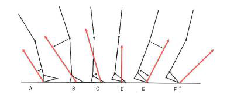
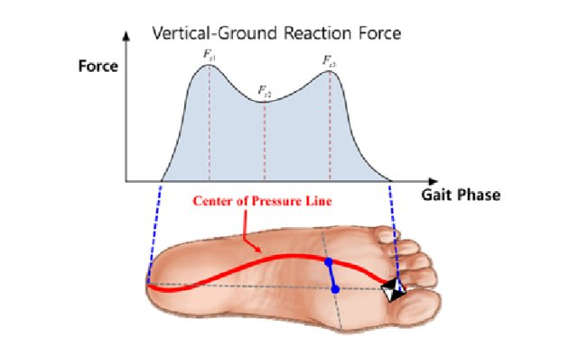

```{r load, message=FALSE, warning=FALSE, echo = FALSE}
library(knitr)
library(mlbench)
library(tidyverse)
library(gridExtra) # plotting functions
library(grid)
library(gtable)
library(kableExtra) # table functions
library(bookdown) 
library(broom) # tidy output
library(readxl) # Read in excel files
#library(citr) # Easy citation https://github.com/crsh/citr
```

```{r setup, include=FALSE}
knitr::opts_chunk$set(
  echo = FALSE,
  include = TRUE,
  cache = TRUE,
  fig.pos = "H")
```

\newpage

# 1 Introduction

## 1.1 Summary

This document analyses the *GaitRec* dataset which is freely available [online](https://doi.org/10.6084/m9.figshare.c.4788012.v1). The dataset has, furthermore, been published by Horsak et al. in Nature, Scientific Data [@Horsak2020]. It contains a large-scale dataset of *ground reaction forces* (GRF) during walking of 211 healthy (HC) and 2084 impaired persons. Included patients had different conditions affecting either the hip (H), knee (K), ankle (A), or calcaneus (C). In total, 75.732 bi-lateral walking trials have been compiled.

Before the *GaitRec* dataset will be described in more detail (Chapter 1.3) and the research question will be explored (Chapter 1.4 and 2) and analyzed (Chapter 3) a short background information about GRF and gait analysis will be given. 

## 1.2 Gait analysis and ground reaction forces

Human movement is a complex topic and a growing research field. According to @bakerHistoryGaitAnalysis2007 Aristotle (384 until 322 BC) was one of the first known scientists to analyze human walking. It was not until the late 19th and early 20th century, however, that scientific methods started to be applied to gait analysis simulated by new measurement techniques. 

Two main areas are mainly covered in human movement analysis: *kinematics* - the science of movement (without considering the forces which are responsible for the movements), and *kinetics* - the science of forces producing these movements. One such force acting on the body is the GRF which is the response of the ground to the foot contact. This GRF can be measured using so called force plates, which are normally embedded into the floor. 

If a person would simply stand one such a plate it would measure the person's weight in Newton. Due to Newton's third law ("every action has an equal and opposite reaction") the measured force is the same force the person is "putting" into the ground but has opposite direction [@NewtonLawsMotion2021]. This means that the GRF would point vertically through the body. When the person is walking over the force plate, the GRF can increase due to acceleration forces and its direction is changing according to the center of mass of the person, see Figure \ref{GRF}.

```{r GRF, fig.cap = "Progression of the ground reaction force during walking - sagittal view.\\label{GRF}", fig.align="center"}

```

The GRF is defined in a 3D space and can be split in three components, which represent the

* anterior-posterior AP (X)
* medial-lateral ML (Y) and
* vertical V (Z)

direction. The X, Y, and Z labeling is arbitrary and can change throughout publications. The X-direction defines the force produced in walking direction, the Y-direction represents frontal forces and the vertical Z- direction defines the force vertically through the body. During the stance phase of walking the GRF changes according to the acceleration and deceleration of the body on the force plate (see Figure \ref{GRF2}). 

```{r GRF2, fig.cap = "GRF distribution in X, Y and Z direction during the stance phase of walking. \\label{GRF2}", message = FALSE}
GRFexample <- as_tibble(read_excel('GRF_Example.xlsx'))

GRFmeans_long <- GRFexample %>% 
  select(Frame,Z_mean,Y_mean,X_mean) %>% 
  rename(Z = Z_mean, Y = Y_mean, X = X_mean) %>% 
  gather(key = "variable", value = "mean", -Frame)

GRFsd_long <- GRFexample %>% 
  select(Frame,Z_SD,Y_SD,X_SD) %>% 
  rename(Z = Z_SD, Y = Y_SD, X = X_SD) %>% 
  gather(key = "variable", value = "sd", -Frame)

GRF_join <- GRFmeans_long %>% 
  left_join(GRFsd_long)

ggplot(data = GRF_join, aes(x = Frame, group = variable)) + 
  geom_line(aes(y = mean, color = variable), size = 1) + 
  geom_ribbon(aes(y = mean, ymin = mean - sd, ymax = mean + sd, fill = variable), alpha = .2) +
  xlab("Stance phase [%]") + 
  ylab("Force [N]") + 
  theme_bw() +  
  theme(legend.key = element_blank()) + 
  theme(plot.margin=unit(c(1,3,1,1),"cm"))+
  theme(legend.position = c(1.1,.6), legend.direction = "vertical") +
  theme(legend.title = element_blank()) +
  geom_segment(aes(x = 23, y = 0.85, xend = 23, yend = 1), colour = "blue",
                  arrow = arrow(length = unit(0.5, "cm"))) +
  geom_segment(aes(x = 79, y = 0.85, xend = 79, yend = 1), colour = "blue",
                  arrow = arrow(length = unit(0.5, "cm"))) +
  geom_segment(aes(x = 50, y = 1, xend = 50, yend = 0.85), colour = "blue",
                  arrow = arrow(length = unit(0.5, "cm"))) +
  geom_segment(aes(x = 15, y = 0, xend = 15, yend = -0.15), colour = "red",
                  arrow = arrow(length = unit(0.5, "cm"))) +
  geom_segment(aes(x = 87.5, y = 0.05, xend = 87.5, yend = 0.2), colour = "red",
                  arrow = arrow(length = unit(0.5, "cm"))) +
  geom_segment(aes(x = 6, y = 0.15, xend = 6, yend = 0), colour = "green",
                  arrow = arrow(length = unit(0.5, "cm"))) +
  geom_segment(aes(x = 25, y = -0.15, xend = 25, yend = 0), colour = "green",
                  arrow = arrow(length = unit(0.5, "cm"))) +
  geom_segment(aes(x = 77, y = -0.15, xend = 77, yend = 0), colour = "green",
                  arrow = arrow(length = unit(0.5, "cm")))
```

Additionally to the three force components, another parameter related to the GRF is often analyzed, the so called *center of pressure* (COP). This parameter simply describes, where the force is centered under the foot, i.e., where the most force is concentrated. It is displayed in a 2D space onto the floor. During gait, this COP is traveling from the heel (during initial foot contact on the floor) to the toes (at the end of stance when the foot leaves the ground). If one would imagine to observe the GRF from above, the COP would draw a line through the foot (see Figure \ref{COP}, adopted from @limDevelopmentRealtimeGait2017). 

```{r COP, out.width="80%", out.height="80%", fig.cap = "Vertical GRF vs. center of pressure line under the foot - view from above.\\label{COP}", fig.align="center"}

```

Like the GRF, the COP can be divided in its components, the 

* anterior-posterior AP (X) and
* medial-lateral ML (Y)

direction. The X-direction of the COP describes the propulsion of the COP in walking direction while the Y-direction is the medial-lateral shift of the COP under the foot.


## 1.3 Discrete Parameters of the GRF and COP

In case the musculoskeletal system is impaired, the shape of the GRF as well as the COP can change (e.g., @johnContributionsMusclesMediolateral2012). To understand if these changes have a clinical impact on the patient, specific discrete parameters are analyzed in detail during a clinical gait analysis. These discrete parameters are the maximum and minimum forces of each GRF component during stance phase (see Figure \ref{GRF2}, arrows).

The length of the COP line gives additionally information about the walking stability of the patient [@gaoCenterPressureProgression2019]. Is the length in X-direction shortened (i.e., distance between most distal to most proximal COP point) it might point to an asymmetric gait and a shorter single leg stance phase (i.e. when the contra-lateral leg is off the ground). An increase in a medial-lateral amplitude of the COP line (i.e., distance of most medial to most lateral point of the COP line) mostly implies insecurity during gait.

Important discrete parameters related to the GRF and COP can be found in Table (\ref{tab:table1}).

```{r table1, echo = FALSE}
varNames <- c( "GRF_F_V_max1" , 
               "GRF_F_V_max2" , 
               "GRF_F_V_min" , 
               "GRF_F_AP_max" , 
               "GRF_F_AP_min", 
               "GRF_F_ML_max1" , 
               "GRF_F_ML_max2" , 
               "GRF_F_ML_min" , 
               "GRF_COP_AP_length" , 
               "GRF_COP_ML_length")
varExpl <- c("Maximum of vertical GRF in first half of stance" , 
             "Maximum of vertical GRF in second half of stance" , 
             "Minimum of vertical GRF between both maxima" , 
             "Maximum of anterior-posterior GRF in second half of stance" , 
             "Minimum of anterior-posterior GRF in first half of stance", 
             "Maximum of medial-lateral GRF in first half of stance" , 
             "Maximum of medial-lateral GRF in second half of stance" , 
             "Minimum of medial-lateral GRF at initial foot contact" , 
             "Length of COP course in anterior-posterior direction during stance", 
             "Length of COP course in medial-lateral direction during stance")

kable(cbind(varNames,varExpl), 
                caption = "Discrete parameters of the GRF during walking", 
                col.names = c("Variable Name","detailed information"),
      booktabs = T) %>% 
  kable_styling(latex_options = "striped", font_size = 8)
```


## 1.4 The *GaitRec* dataset in detail

```{r readData, include=FALSE}
# read in data
metaData <- read.csv('GRF_metadata.csv')
AllData <- read.csv('AllData.csv')
```

```{r dataStructure,  include=FALSE, message=FALSE, warning=FALSE, echo = FALSE}
#Data types of variables
str(metaData)
```

The GaitRec dataset consists of several .CSV files. The main document ("GRF_metadata.csv") includes information about the participants and session (see Table \ref{tab:table2}), while the remaining files contain the raw and processed GRF and COP data. The raw data present the measurements purely received from the force plates, i.e., no data cleaning has been undertaken. In the processed files, following steps have been undertaken to clean and tidy up the dataset:

- Force signals were filtered with a 2nd order low-pass butterworth filter with a cut-off frequency of 20Hz to reduce noise,
- time normalized to 100% stance (i.e. 101 data points) to reduce effects temporal differences, and then
- normalized to the body weight of each participant (force divided by the body mass times gravity) to reduce effects due to individual anthropometry.
- Threshold of 80N to avoid inaccuracies in COP calculation at small force values
- Medio-lateral COP coordinates were mean-centered 
- Anterior-posterior coordinates zero-centered


```{r table2, echo = FALSE}
varNames <- c( "Healthy condition",
               "Sex" , 
               "Age" , 
               "Shod condition" , 
               "Insole" , 
               "Speed")
varExpl <- c("Where the participant had an injury (calcaneus, ankle, knee, hip) or healthy",
             "Gender male or female" , 
             "Age of participant in years" , 
             "Shoed or barfeet walking" , 
             "With or without orthopaedic insoles" , 
             "Walking speed")

kable(cbind(varNames,varExpl), 
                caption = "Influencing factors", 
                col.names = c("Variable Name","detailed information"),
      booktabs = T) %>% 
  kable_styling(latex_options = "striped", font_size = 8)
```

As described in Chapter 1.1, the dataset can be divided into five groups of participants, one healthy group and four different patient groups. Anthopometrics of each group is shown in Table \ref{Anthro}).

```{r figureAnthro, message=FALSE, fig.cap = "Anthropometrics and number of cases of each sub-group.\\label{Anthro}"}
# Group data by Subject ID to create overview table
metaDataCompressed <- metaData %>% group_by(SUBJECT_ID) %>% 
  summarize(Group=first(CLASS_LABEL),
            Sex=first(SEX),
            Age=mean(AGE),
            Height=first(HEIGHT),
            BodyMass=mean(BODY_MASS))

table <- metaDataCompressed %>%
  group_by(Group) %>% 
  summarise(Age = round(mean(Age), digits = 0), #  patients = n()
            Height = round(mean(Height, na.rm = TRUE), digits = 0),
            BodyMass = round(mean(BodyMass), digits = 0)) %>%
    tableGrob()

title <- textGrob("Group anthopometrics",gp=gpar(fontsize=12))
padding <- unit(0.5,"line")
table <- gtable_add_rows(table, 
                         heights = grobHeight(title) + padding,
                         pos = 0)
table <- gtable_add_grob(table, title,
                         t=1, l=1, 
                         r=ncol(table))

metaDataCompressed$Group <- as.factor(metaDataCompressed$Group)
plot2 <- metaDataCompressed %>% ggplot(aes(Group)) +
  geom_bar(fill = c("#ff9999","#ffcccc","#ff9999","#ffcccc","#ff9999")) +
  xlab("Cardiovascular group") +
  ylab("Number of cases") +
  theme_bw()

gridExtra::grid.arrange(table, plot2, nrow = 1, bottom = textGrob("A = Ankle, C = Calcaneus, H = Hip, K = Knee, HC = Healthy Control", x = 1, hjust = 1, gp = gpar(fontface = 3L, fontsize = 9)))

```


Following parameters might have an effect on discrete variables:


## 1.5 Reseach Question

\newpage

# 2 Methods

\newpage

# 3 Results

\newpage

# 4 Discussion

\newpage

# 5 Conclusion

\newpage

# References