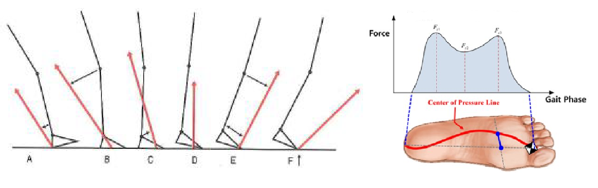

```{r load, message=FALSE, warning=FALSE, echo = FALSE}
library(knitr)
library(mlbench)
library(tidyverse)
library(gridExtra) # plotting functions
library(grid)
library(gtable)
library(kableExtra) # table functions
library(bookdown) 
library(broom) # tidy output
library(readxl) # Read in excel files
library(qwraps2) # mean and sd as string
library(rstatix) # --> Shapiro Test
library(ggpubr)
options(qwraps2_markup = "markdown")
library(GGally) # For correlation figure
library(caret) # Fitting classiciation and regression models
library(lme4) # Mixed linear models - account for covariates
library(mgcv) # Generalized additive model
library(leaps) # for computing best subset regression
library(pROC) # Graph AUC
#library(citr) # Easy citation https://github.com/crsh/citr
```

```{r setup, include=FALSE}
knitr::opts_chunk$set(
  echo = FALSE,
  include = TRUE,
  cache = TRUE,
  warning=FALSE,
  fig.pos = "H")
```

\newpage

# Introduction

## Summary

This document analyses the *GaitRec* dataset which is freely available [online](https://doi.org/10.6084/m9.figshare.c.4788012.v1). The dataset has, furthermore, been published by Horsak et al. in Nature, Scientific Data [@Horsak2020]. It contains a large-scale dataset of *ground reaction forces* (GRF) during walking of 211 healthy (HC) and 2084 impaired persons. Included patients had different conditions affecting either the hip (H), knee (K), ankle (A), or calcaneus (C). In total, 75.732 bi-lateral walking trials have been compiled.

Before the *GaitRec* dataset will be described in more detail (Chapter 1.4) and the research question will be explored (Chapter 1.5) and analyzed (Chapter 2) a short background information about GRF and gait analysis will be given. 

## Gait analysis and ground reaction forces

Human movement is a complex topic and a growing research field. According to @bakerHistoryGaitAnalysis2007 Aristotle (384 until 322 BC) was one of the first known scientists to analyze human walking. It was not until the late 19th and early 20th century, however, that scientific methods started to be applied to gait analysis simulated by new measurement techniques. 

Two main areas are mainly covered in human movement analysis: *kinematics* - the science of movement (without considering the forces which are responsible for the movements), and *kinetics* - the science of forces producing these movements. One such force acting on the body is the GRF which is the response of the ground to the foot contact. This GRF can be measured using so called force plates, which are normally embedded into the floor. 

If a person would simply stand one such a plate it would measure the person's weight in Newton. Due to Newton's third law ("every action has an equal and opposite reaction") the measured force is the same force the person is "putting" into the ground but has opposite direction [@NewtonLawsMotion2021]. This means that the GRF would point vertically through the body. When the person is walking over the force plate, the GRF can increase due to acceleration forces and its direction is changing according to the center of mass of the person, see Figure \ref{GRF_COP} left.

```{r GRF_COP, fig.cap = "Progression of GRF under the foot - sagittal view (left) and view from above (right).\\label{GRF_COP}", fig.align="center"}

```

The GRF is defined in a 3D space and can be split in three components, which represent the

* anterior-posterior AP (X)
* medial-lateral ML (Y) and
* vertical V (Z)

direction. The X, Y, and Z labeling is arbitrary and can change throughout publications. The X-direction defines the force produced in walking direction, the Y-direction represents frontal forces and the vertical Z- direction defines the force vertically through the body. During the stance phase of walking the GRF changes according to the acceleration and deceleration of the body on the force plate (see Figure \ref{GRF2}). 

```{r GRF2, fig.height= 2, fig.width= 4, fig.cap = "GRF distribution in X, Y and Z direction during the stance phase of walking. Arrows define discrete parameters of interest. \\label{GRF2}", message = FALSE}
# Load example data for GRF traces
GRFexample <- as_tibble(read_excel('GRF_Example.xlsx'))
# Prepare data for figure
GRFmeans_long <- GRFexample %>% 
  select(Frame,Z_mean,Y_mean,X_mean) %>% 
  rename(Z = Z_mean, Y = Y_mean, X = X_mean) %>% 
  gather(key = "variable", value = "mean", -Frame)
GRFsd_long <- GRFexample %>% 
  select(Frame,Z_SD,Y_SD,X_SD) %>% 
  rename(Z = Z_SD, Y = Y_SD, X = X_SD) %>% 
  gather(key = "variable", value = "sd", -Frame)
GRF_join <- GRFmeans_long %>% 
  left_join(GRFsd_long)
# Create figure and include arrows which point to discrete parameters
ggplot(data = GRF_join, aes(x = Frame, group = variable)) + 
  geom_line(aes(y = mean, color = variable), size = 1) + 
  geom_ribbon(aes(y = mean, ymin = mean - sd, ymax = mean + sd, fill = variable), alpha = .2) +
  xlab("Stance phase [%]") + 
  ylab("Force [N]") + 
  theme_bw() +  
  theme(legend.key = element_blank()) + 
  theme(plot.margin=unit(c(0,0.2,0,0),"null"))+
  theme(legend.position = c(1.1,.6), legend.direction = "vertical") +
  theme(legend.title = element_blank()) +
  geom_segment(aes(x = 23, y = 0.85, xend = 23, yend = 1), colour = "blue",
                  arrow = arrow(length = unit(0.5, "cm"))) +
  geom_segment(aes(x = 79, y = 0.85, xend = 79, yend = 1), colour = "blue",
                  arrow = arrow(length = unit(0.5, "cm"))) +
  geom_segment(aes(x = 50, y = 1, xend = 50, yend = 0.85), colour = "blue",
                  arrow = arrow(length = unit(0.5, "cm"))) +
  geom_segment(aes(x = 15, y = 0, xend = 15, yend = -0.15), colour = "red",
                  arrow = arrow(length = unit(0.5, "cm"))) +
  geom_segment(aes(x = 87.5, y = 0.05, xend = 87.5, yend = 0.2), colour = "red",
                  arrow = arrow(length = unit(0.5, "cm"))) +
  geom_segment(aes(x = 6, y = 0.15, xend = 6, yend = 0), colour = "green",
                  arrow = arrow(length = unit(0.5, "cm"))) +
  geom_segment(aes(x = 25, y = -0.15, xend = 25, yend = 0), colour = "green",
                  arrow = arrow(length = unit(0.5, "cm"))) +
  geom_segment(aes(x = 77, y = -0.15, xend = 77, yend = 0), colour = "green",
                  arrow = arrow(length = unit(0.5, "cm")))
```

Additionally to the three force components, another parameter related to the GRF is often analyzed, the so called *center of pressure* (COP). This parameter simply describes, where the force is centered under the foot, i.e., where the most force is concentrated. It is displayed in a 2D space onto the floor. During gait, this COP is traveling from the heel (during initial foot contact on the floor) to the toes (at the end of stance when the foot leaves the ground). If one would imagine to observe the GRF from above, the COP would draw a line through the foot (see Figure \ref{GRF_COP} right side, adopted from @limDevelopmentRealtimeGait2017). 


Like the GRF, the COP can be divided in its components, the 

* anterior-posterior AP (X) and
* medial-lateral ML (Y)

direction. The X-direction of the COP describes the propulsion of the COP in walking direction while the Y-direction is the medial-lateral shift of the COP under the foot.


## Discrete Parameters of the GRF and COP

In case the musculoskeletal system is impaired, the shape of the GRF as well as the COP can change (e.g., @johnContributionsMusclesMediolateral2012). To understand if these changes have a clinical impact on the patient, specific discrete parameters are analyzed in detail during a clinical gait analysis. These discrete parameters are the maximum and minimum forces of each GRF component during stance phase (see Figure \ref{GRF2}, arrows).

The length of the COP line gives additionally information about the walking stability of the patient [@gaoCenterPressureProgression2019]. Is the length in X-direction shortened (i.e., distance between most distal to most proximal COP point) it might point to an asymmetric gait and a shorter single leg stance phase (i.e. when the contra-lateral leg is off the ground). An increase in a medial-lateral amplitude of the COP line (i.e., distance of most medial to most lateral point of the COP line) mostly implies insecurity during gait.

Important discrete parameters related to the GRF and COP can be found in Table (\ref{tab:table1}).

```{r table1, echo = FALSE}
varNames <- c( "F_V_max1" , 
               "F_V_max2" , 
               "F_V_min" , 
               "F_AP_max" , 
               "F_AP_min", 
               "F_ML_max1" , 
               "F_ML_max2" , 
               "F_ML_min" , 
               "COP_AP" , 
               "COP_MLh")
varExpl <- c("Maximum of vertical GRF in first half of stance" , 
             "Maximum of vertical GRF in second half of stance" , 
             "Minimum of vertical GRF between both maxima" , 
             "Maximum of anterior-posterior GRF in second half of stance" , 
             "Minimum of anterior-posterior GRF in first half of stance", 
             "Maximum of medial-lateral GRF in first half of stance" , 
             "Maximum of medial-lateral GRF in second half of stance" , 
             "Minimum of medial-lateral GRF at initial foot contact" , 
             "Length of COP course in anterior-posterior direction during stance", 
             "Length of COP course in medial-lateral direction during stance")

cbind(varNames,varExpl) %>% 
  kbl(caption = "Discrete parameters of the GRF during walking", 
                col.names = c("Variable Name","detailed information"),
      booktabs = T) %>% 
  kable_styling(latex_options = "striped", font_size = 10)
```


## The *GaitRec* dataset in detail

```{r readData, include=FALSE}
# read in data
metaData <- read.csv('GRF_metadata.csv')
AllData <- read.csv('AllData.csv')
```

```{r dataStructure,  include=FALSE, message=FALSE, echo = FALSE}
#Data types of variables
str(metaData)
```

The GaitRec dataset consists of several .CSV files. The main document ("GRF_metadata.csv") includes main information about the participants and measurement trial (see Table \ref{tab:table2}). The remaining files contain the raw and pre-processed GRF and COP time series of the stance phase of walking. The raw data present the measurements purely received from the force plates, i.e., no data cleaning has been undertaken. In the pre-processed files, following steps have been undertaken to clean and tidy up the dataset:

- Force signals were filtered with a 2nd order low-pass butterworth filter with a cut-off frequency of 20Hz to reduce noise,
- time normalized to 100% stance (i.e. 101 data points) to reduce effects temporal differences, and then
- normalized to the body weight of each participant (force divided by the body mass times gravity) to reduce effects due to individual anthropometry.
- Threshold of 80N to avoid inaccuracies in COP calculation at small force values
- Medio-lateral COP coordinates were mean-centered 
- Anterior-posterior coordinates zero-centered

This report includes the pre-processed GRF and COP dataset.

```{r table2, echo = FALSE}
varNames <- c( "Sex (male, female)" , 
               "Age (years)" , 
               "Height (cm)",
               "Body mass (kg) and weight (kg*m/s^2)",
               "Shoe size (EU)" , 
               "Affected side (left, right, both)")
varExpl <- c("Shod condition (barefoot, shoe)",
             "Orthopaedic insole (yes, no)" , 
             "Walking speed (slow, self-selected, fast)" , 
             "Readmission into hospital (yes, no)" , 
             "Session type (initial vs. control measurement)" , 
             "Session date")

kable(cbind(varNames,varExpl), 
                caption = "Participant and trial metadata of the GaitRec dataset", 
                col.names = c("Participant","Walking trial"),
      booktabs = T) %>% 
  kable_styling(latex_options = "striped", font_size = 10)
```
As described in Chapter 1.1, participants can be divided into five different groups, one healthy group and four different patient groups. Number of participants per group varied slightly between subgroups (Figure \ref{Anthro} B), however, all exceeded 200 number of cases. Anthropometrics of each group is summarized in Figure \ref{Anthro} A. A more detailed visualization of age and BMI distribution between groups is shown in sub-Figure C and D. 
While anthropometrics are similar distributed between patient groups, the healthy control group seems to be younger with a smaller BMI than the patients. Running a Kruskal-Wallis-Test (Shapiro Test shows non-normal distribution) and a pairwise Wilcoxon test for Post-hoc analysis, differences can be shown between healthy controls and each patient group (see Figure \ref{Anthro} C and D). Analysis further down below will, therefore, include age and BMI as covariates.

```{r AnthroStats,message = FALSE, include = FALSE}
# Group data by Subject ID to create overview table and calculate BMI
metaDataCompressed <- metaData %>% group_by(SUBJECT_ID) %>% 
  summarize(Group=first(CLASS_LABEL),
            Sex=first(SEX),
            Age=mean(AGE),
            Height=first(HEIGHT),
            BodyMass=mean(BODY_MASS))
BMI <- metaDataCompressed$BodyMass/((metaDataCompressed$Height/100)^2)
metaDataCompressed <- metaDataCompressed %>%  mutate(metaDataCompressed, BMI = BMI)

# Check for normal distribution
metaDataCompressed %>%
  group_by(Group) %>%
  shapiro_test(Age,BMI)

# Kruskal Wallis Test
KW_Age <- kruskal.test(metaDataCompressed$Age,metaDataCompressed$Group)
KW_BMI <- kruskal.test(metaDataCompressed$BMI,metaDataCompressed$Group)

# Post-hoc Test
PH_Age <- pairwise.wilcox.test(metaDataCompressed$Age,metaDataCompressed$Group, p.adjust="bonferroni")
PH_BMI <- pairwise.wilcox.test(metaDataCompressed$BMI,metaDataCompressed$Group, p.adjust="bonferroni")

# For Figure definition of significant differences
Age_pVal <- as.data.frame(t(PH_Age[["p.value"]])) %>% rownames_to_column(var = "Group") %>% 
  as_tibble() %>% gather(condition,pAge,C:K) %>% filter(pAge < 0.05)
pValAge_List <- vector()
for(i in 1:nrow(Age_pVal)) {
  pValAge_List[i] <- list(c(Age_pVal$Group[i],Age_pVal$condition[i]))
}
BMI_pVal <- as.data.frame(t(PH_BMI[["p.value"]])) %>% rownames_to_column(var = "Group") %>% 
  as_tibble() %>% gather(condition,pBMI,C:K) %>% filter(pBMI < 0.05)
pValBMI_List <- vector()
for(i in 1:nrow(BMI_pVal)) {
  pValBMI_List[i] <- list(c(BMI_pVal$Group[i],BMI_pVal$condition[i]))
}
```

```{r figureAnthro, fig.height= 8, fig.width = 10.5, message=FALSE, fig.cap = "Anthropometrics and number of cases of each sub-group.\\label{Anthro}"}

# Define Summary structure for mean and SD
summary_str <- list("Data" = list("Age (years)" = ~ qwraps2::mean_sd(Age, denote_sd = "paren", na_rm = TRUE, show_n = "never", digits = 1),
        "Height (cm)" = ~ qwraps2::mean_sd(Height, denote_sd = "paren", na_rm = TRUE, show_n = "never", digits = 1),
         "Body mass (kg)" = ~ qwraps2::mean_sd(BodyMass, denote_sd = "paren", na_rm = TRUE, show_n = "never", digits = 1),
        "BMI(km/m^2)" = ~ qwraps2::mean_sd(BMI, denote_sd = "paren", na_rm = TRUE, show_n = "never", digits = 1)))

# Create table with summary information
table <- metaDataCompressed %>%
  group_by(Group) %>%
  summary_table(summary_str) %>% 
  tableGrob(., theme=ttheme_default(base_size = 10))


# Tidy up table and give it a title
title <- textGrob("Mean (SD) of group anthopometrics",gp=gpar(fontsize=11))
padding <- unit(0.5,"line")
table <- gtable_add_rows(table, 
                         heights = grobHeight(title) + padding,
                         pos = 0)
table <- gtable_add_grob(table, title,
                         t=1, l=1, 
                         r=ncol(table))
table <- arrangeGrob(table, top = textGrob("A", x = unit(0, "npc")
         , y   = unit(1, "npc"), just=c("left","top"),
         gp=gpar(col="black", fontsize=14)))

# Define a bar chart with numbers per group
metaDataCompressed$Group <- as.factor(metaDataCompressed$Group)
plot1 <- metaDataCompressed %>% ggplot(aes(Group)) +
  geom_bar(fill = c("#D8D8D8","#727272","#D8D8D8","#727272","#D8D8D8")) +
  xlab("Cardiovascular group") +
  ylab("Number of cases") +
  labs(tag = "B") +
  theme_bw() +
  coord_fixed(ratio = 0.005)

# Distribution of age and BMI compared between groups
plot2 <- metaDataCompressed %>% ggplot(aes(x=Group, y=Age, fill=Group)) + 
  geom_boxplot(adjust=1.5, alpha=.4) + labs(tag = "C") + stat_compare_means(label.y = 105) +
  stat_compare_means(comparisons = pValAge_List) + theme_bw()
plot3 <- metaDataCompressed %>% ggplot(aes(x=Group, y=BMI, fill=Group)) + 
  geom_boxplot(adjust=1.5, alpha=.4) + labs(tag = "D") + stat_compare_means(label.y = 68) +
  stat_compare_means(comparisons = pValBMI_List) + theme_bw()

# Combine Table and Figure, create footnote
gridExtra::grid.arrange(table, plot1, plot2, plot3, nrow = 2, bottom = textGrob("A = Ankle, C = Calcaneus, H = Hip, K = Knee, HC = Healthy Control", x = 1, hjust = 1, gp = gpar(fontface = 3L, fontsize = 9)))

```


## Reseach Question

A full gait analysis is time consuming and needs trained personnel. Calculating joint angles and joint moments as well as power needs professional knowledge and results are not intuitive to understand. Therefore, simply using GRF to analyze the walking pattern would be time efficient and can be undertaken by non-trained personnel, while distinctive differences in discrete parameters of the GRF ("higher", "lower") can be easily interpreted.
The research question of this report is, therefore, if and which discrete parameters of the GRF can be used to distinguish between patients with impairments of the lower limb and a healthy control group. Dependent variable (i.e. primary endpoint) to analyze will be the factorial variable healthy yes or no.

While age and BMI have above been shown to differ between healthy controls and patient groups and are identified as possible covariates, other main factors have been shown to influence gait analysis outcome: shod condition [@oeffingerComparisonGaitShoes1999] and walking speed [@schwartzEffectWalkingSpeed2008]. Therefore, it is of high interest to understand, which other variables might have an influence on the predictions outcome to be able to control for these covariates.

\newpage

# Data analysis strategy

## Preparing and exploring the dataset

The pre-processed dataset provided by @horsakGaitRecLargescaleGround2020 has been further processed by extracting discrete parameters (see Appendix for coding), presented in Table \ref{tab:table1}, and calculating the mean of eack discrete parameter above all walking trials for each participant and each session. In another step, variables' data type have been checked, while variables "sex", "affected side", "shod condition", and "speed" have been changed from numeric to factor. Also, discrete parameters, available for each leg side (left and right) had to be assigned to the healthy or to the affected side.

```{r dataCleaning, include = FALSE}
# Check data type of variables
str(AllData)
# Remove unnecessarry variables
AllData <- subset(AllData, select = -c(CLASS_LABEL_DETAILED,ORTHOPEDIC_INSOLE,READMISSION))
# Change nominal variables defined es number to factor
AllData<- AllData %>% 
  mutate(
    SEX = factor(SEX, levels = c(0, 1), labels = c("female", "male")),
    AFFECTED_SIDE = factor(AFFECTED_SIDE, exclude = NULL, levels = c(0, 1, 2, NA), labels = c("left", "right", "both", "none")),
    SHOD_CONDITION = factor(SHOD_CONDITION, levels = c(0, 1, 2), labels = c("barefeet", "normalShoe", "orthopaedicShoe")),
    SPEED = factor(SPEED, levels = c(1, 2, 3), labels = c("slow", "selfSelected", "fast"))
    ) %>% 
  mutate_if(is.character, as.factor)

BMI <- AllData$BODY_MASS/((AllData$HEIGHT/100)^2)
AllData <- AllData %>%  mutate(AllData, BMI = BMI)

summary(AllData)
sapply(AllData, function(x) sum(is.na(x)))

# Order discrete variable to leg side for each parameter (e.g. GRF_F_V_r_max1 and GRF_F_V_l_max1 to one variable F_V_max1 and leg side)
Sub1 <- AllData %>% select(X:GRF_F_V_l_max1,BMI) %>% 
  gather( GRF_F_V_r_max1, GRF_F_V_l_max1, key = "side", value= "F_V_max1") %>% 
  mutate(side = factor(side, levels = c("GRF_F_V_l_max1","GRF_F_V_r_max1"), labels = c("left", "right")))
Sub2 <- AllData %>% select(SESSION_ID,GRF_F_V_r_max2, GRF_F_V_l_max2) %>% 
  gather( GRF_F_V_r_max2, GRF_F_V_l_max2, key = "side", value= "F_V_max2") %>% 
  mutate(side = factor(side, levels = c("GRF_F_V_l_max2","GRF_F_V_r_max2"), labels = c("left", "right")))
Sub3 <- AllData %>% select(SESSION_ID,GRF_F_V_r_min, GRF_F_V_l_min) %>% 
  gather( GRF_F_V_r_min, GRF_F_V_l_min, key = "side", value= "F_V_min") %>% 
  mutate(side = factor(side, levels = c("GRF_F_V_l_min","GRF_F_V_r_min"), labels = c("left", "right")))  
Sub4 <- AllData %>% select(SESSION_ID,GRF_F_AP_r_max, GRF_F_AP_l_max) %>% 
  gather( GRF_F_AP_r_max, GRF_F_AP_l_max, key = "side", value= "F_AP_max") %>% 
  mutate(side = factor(side, levels = c("GRF_F_AP_l_max","GRF_F_AP_r_max"), labels = c("left", "right")))
Sub5 <- AllData %>% select(SESSION_ID,GRF_F_AP_r_min, GRF_F_AP_l_min) %>% 
  gather( GRF_F_AP_r_min, GRF_F_AP_l_min, key = "side", value= "F_AP_min") %>% 
  mutate(side = factor(side, levels = c("GRF_F_AP_l_min","GRF_F_AP_r_min"), labels = c("left", "right")))  
Sub6 <- AllData %>% select(SESSION_ID,GRF_F_ML_r_max1, GRF_F_ML_l_max1) %>% 
  gather( GRF_F_ML_r_max1, GRF_F_ML_l_max1, key = "side", value= "F_ML_max1") %>% 
  mutate(side = factor(side, levels = c("GRF_F_ML_l_max1","GRF_F_ML_r_max1"), labels = c("left", "right")))
Sub7 <- AllData %>% select(SESSION_ID,GRF_F_ML_r_max2, GRF_F_ML_l_max2) %>% 
  gather( GRF_F_ML_r_max2, GRF_F_ML_l_max2, key = "side", value= "F_ML_max2") %>% 
  mutate(side = factor(side, levels = c("GRF_F_ML_l_max2","GRF_F_ML_r_max2"), labels = c("left", "right")))
Sub8 <- AllData %>% select(SESSION_ID,GRF_F_ML_r_min, GRF_F_ML_l_min) %>% 
  gather( GRF_F_ML_r_min, GRF_F_ML_l_min, key = "side", value= "F_ML_min") %>% 
  mutate(side = factor(side, levels = c("GRF_F_ML_l_min","GRF_F_ML_r_min"), labels = c("left", "right")))  
Sub9 <- AllData %>% select(SESSION_ID,GRF_COP_AP_r_length, GRF_COP_AP_l_length) %>% 
  gather( GRF_COP_AP_r_length, GRF_COP_AP_l_length, key = "side", value= "COP_AP") %>% 
  mutate(side = factor(side, levels = c("GRF_COP_AP_l_length","GRF_COP_AP_r_length"), labels = c("left", "right")))  
Sub10 <- AllData %>% select(SESSION_ID,GRF_COP_ML_r_length, GRF_COP_ML_l_length) %>% 
  gather( GRF_COP_ML_r_length, GRF_COP_ML_l_length, key = "side", value= "COP_ML") %>% 
  mutate(side = factor(side, levels = c("GRF_COP_ML_l_length","GRF_COP_ML_r_length"), labels = c("left", "right"))) 

# Merge all Sub DF together
AllData2 <- list(Sub1,Sub2,Sub3,Sub4,Sub5,Sub6,Sub7,Sub8,Sub9,Sub10) %>% reduce(full_join, by = c("SESSION_ID","side"))

# Define if side is affected or not
Disease <- with(AllData2,ifelse(AFFECTED_SIDE == "none","Healthy",
                ifelse(AFFECTED_SIDE == "both","Affected",
                      ifelse(AFFECTED_SIDE == "right" & side == "right","Affected",
                            ifelse(AFFECTED_SIDE == "left" & side == "left","Affected","Healthy")))))

# Define if participant is healthy (HC) or not (all others)
HC <- ifelse(AllData2$CLASS_LABEL == "HC","YES","NO")


# Final dataset
AllDataFinal <- mutate(AllData2,Disease,HC)
```

Within the whole dataset there are `r sum(is.na(AllData))` missing values, which are related to body height (and, therefore, BMI) and shoe size (`r sum(is.na(AllData$BMI))` , `r sum(is.na(AllData$SHOE_SIZE))` respectively). In total, information of `r sum(complete.cases(AllData))` participants are complete, while `r sum(!complete.cases(AllData))` participants have at least one missing value. This information is crucial for further analysis where body height (or BMI) and/or shoe size will play a role.

Before one can decide for a proper analysis strategy, the distribution of involved parameters has to be reviewed. Distribution of discrete parameters, which have been calculated, can be seen in Figures \ref{Dist1} to Figure \ref{Dist4}. Most of the discrete parameters have a symmetric shape for each group and each leg side (healthy vs. affected), which indicates a normal distribution. However, especially the COP length in medial-lateral direction has a right-skewed tendency.

```{r distribution1, fig.height= 4, message=FALSE, fig.cap = "Distribution of anterior-posterior GRF force divided in group and leg side.\\label{Dist1}"}

dis1 <- ggplot(AllDataFinal, aes(F_AP_max,fill = CLASS_LABEL)) +
  geom_histogram(bins=15,alpha = 0.5) + facet_grid(Disease ~ CLASS_LABEL) + 
  theme_bw() + theme(legend.position = "none")
dis2 <- ggplot(AllDataFinal, aes(F_AP_min,fill = CLASS_LABEL)) +
  geom_histogram(bins=15,alpha = 0.5) + facet_grid(Disease ~ CLASS_LABEL) + 
  theme_bw() + theme(legend.position = "none")

g1grob <- ggplotGrob(dis1)
g2grob <- ggplotGrob(dis2)

gridExtra::grid.arrange(g1grob, g2grob)

```

```{r distribution2, fig.height= 6, message=FALSE, fig.cap = "Distribution of vertical GRF force divided in group and leg side.\\label{Dist2}"}

dis1 <- ggplot(AllDataFinal, aes(F_V_max1,fill = CLASS_LABEL)) +
  geom_histogram(bins=15,alpha = 0.5) + facet_grid(Disease ~ CLASS_LABEL) + 
  theme_bw() + theme(legend.position = "none")
dis2 <- ggplot(AllDataFinal, aes(F_V_max2,fill = CLASS_LABEL)) +
  geom_histogram(bins=15,alpha = 0.5) + facet_grid(Disease ~ CLASS_LABEL) + 
  theme_bw() + theme(legend.position = "none")
dis3 <- ggplot(AllDataFinal, aes(F_V_min,fill = CLASS_LABEL)) +
  geom_histogram(bins=15,alpha = 0.5) + facet_grid(Disease ~ CLASS_LABEL) + 
  theme_bw() + theme(legend.position = "none")
g1grob <- ggplotGrob(dis1)
g2grob <- ggplotGrob(dis2)
g3grob <- ggplotGrob(dis3)
gridExtra::grid.arrange(g1grob, g2grob, g3grob)

```

```{r distribution3, fig.height= 6, message=FALSE, fig.cap = "Distribution of medial-lateral GRF force divided in group and leg side.\\label{Dist3}"}

dis1 <- ggplot(AllDataFinal, aes(F_ML_max1,fill = CLASS_LABEL)) +
  geom_histogram(bins=15,alpha = 0.5) + facet_grid(Disease ~ CLASS_LABEL) + 
  theme_bw() + theme(legend.position = "none")+ scale_x_continuous(breaks = c(0.04, 0.08, 0.12))
dis2 <- ggplot(AllDataFinal, aes(F_ML_max2,fill = CLASS_LABEL)) +
  geom_histogram(bins=15,alpha = 0.5) + facet_grid(Disease ~ CLASS_LABEL) + 
  theme_bw() + theme(legend.position = "none")
dis3 <- ggplot(AllDataFinal, aes(F_ML_min,fill = CLASS_LABEL)) +
  geom_histogram(bins=15,alpha = 0.5) + facet_grid(Disease ~ CLASS_LABEL) + 
  theme_bw() + theme(legend.position = "none")
g1grob <- ggplotGrob(dis1)
g2grob <- ggplotGrob(dis2)
g3grob <- ggplotGrob(dis3)
gridExtra::grid.arrange(g1grob, g2grob, g3grob)

```

```{r distribution4, fig.height= 4, message=FALSE, fig.cap = "Distribution of COP lengths divided in group and leg side.\\label{Dist4}"}

dis1 <- ggplot(AllDataFinal, aes(COP_AP,fill = CLASS_LABEL)) +
  geom_histogram(bins=15,alpha = 0.5) + facet_grid(Disease ~ CLASS_LABEL) + 
  theme_bw() + theme(legend.position = "none")
dis2 <- ggplot(AllDataFinal, aes(COP_ML,fill = CLASS_LABEL)) +
  geom_histogram(bins=15,alpha = 0.5) + facet_grid(Disease ~ CLASS_LABEL) + 
  theme_bw() + theme(legend.position = "none")

g1grob <- ggplotGrob(dis1)
g2grob <- ggplotGrob(dis2)

gridExtra::grid.arrange(g1grob, g2grob)

```

## Correlation of variables

Furthermore, to receive a first overview about possible interactions between variables and to later be able to apply appropriate statistics, pairwise correlation coefficients are calculated for the numeric variables. The correlation matrix in Figure \ref{Corr} shows manly low correlation coefficients between variables, however, some values exceed a correlation coefficient of +/- 0.5. Some anthropometric data correlate with each other (e.g., height and shoe size), but also discrete GRF and COP parameters with anthropometrics (e.g., length of COP in anterior-posterior direction and shoe size) or with each other (first maximum and minimum of vertical GRF or minimum of vertical and anterior-posterior GRF).

```{r corrAll,fig.cap="Correlation matrix of the numeric predictors.\\label{Corr}"}
AllDataFinal %>% 
  select(AGE,HEIGHT,BODY_WEIGHT,SHOE_SIZE,BMI,F_V_max1:COP_ML) %>% 
  ggcorr(hjust = 0.75, label = FALSE, layout.exp = 1, size = 3)
```

## Fitting different prediction models - GLM, GLMM, GAM

One way of dealing with correlated variables is appropriate variable selection in statistical models. This, among others steps, will be considered while fitting several prediction models. The goal of this report is to build a model that predicts, if a participant has an injury of the lower limb or not (and if yes which injury) while analyzing discrete GRF and COP parameters and account for specific covariates.

In a first step, to gain an overview about the dataset, a classical generalized linear model (GLM) has been fitted onto the whole dataset, using the binomial link function. This allows the dependent variable to be non-normal, which is important for the factorial variable to distinguish between healthy and affected participants. The dependent variable was, therefore, healthy control "yes" or "no", while discrete GRF and COP parameters as well as sex, age, height, BMI, shoe size and speed werre included as indipendent variables.

```{r GLM, message = FALSE, include = FALSE}
GLM <- glm(as.factor(HC) ~ F_V_max1 + F_V_max2 + F_V_min + F_AP_max + F_AP_min + F_ML_max1 + F_ML_max2 + F_ML_min + 
             COP_AP + COP_ML + SEX + AGE + HEIGHT + BMI + SHOE_SIZE + SPEED,
           data = AllDataFinal, family = binomial(link = "logit"), na.action = na.omit)
summary(GLM)

pred <- predict(GLM, AllDataFinal, type = "response")
resultGLM <- table(AllDataFinal$HC, ifelse(pred > 0.5, "Yes", "No"))
```

The GLM model results in an AIC (Akaike information criterion) of `r round(GLM[["aic"]],0)`, while some of the discrete GRF and COP parameters seem to distinguish between healthy and affected participant (i.e., significant). Also, sex, age and height seem significantly different between healthy and affected participant (p < 0.001). Using this simple model, `r round(100/sum(resultGLM)*(resultGLM[1,1]+resultGLM[2,2]),2)`\% of the participants are classified correctly. 

To account for the covariates, which might influence the prediction's outcome (sex, age, height) a generalized linear mixed model (GLMM) has advantages over a classical GLM, as it can adjust for these covariates. With the `lme4` package, GLMM was implemented.
 
```{r GLMM, message = FALSE, include = FALSE}
GLMM <- glmer(as.factor(HC) ~ F_V_max1 + F_V_max2 + F_V_min + F_AP_max + F_AP_min + F_ML_max1 + F_ML_max2 + F_ML_min + 
             COP_AP + COP_ML + (1|SEX) + (1|AGE)+  (1|HEIGHT), data = AllDataFinal, family=binomial(link="logit"))
summary(GLMM)

pred <- predict(GLMM,  na.omit(AllDataFinal), type = "response")
resultGLMM <-table(na.omit(AllDataFinal)$HC, ifelse(pred > 0.5, "Yes", "No"))
```

Applying the GLMM model an AIC of `r round(summary(GLMM)$AIC[1],0)` can be reached, which is bigger than the AIC of the GLM model, thus, seems that the simple GLM model is better fitted to the data than the GLMM model. With the GLMM model, `r round(100/sum(resultGLMM)*(resultGLMM[1,1]+resultGLMM[2,2]),2)`\% of the participants are classified correctly.

Sometimes the assumption of a linear relationship of independent variables with the dependent variable is doubtful. Here, a generalized additive models (GAM) can be used, which fit unknown but smooth functions to the independent variables, which are estimated using specific techniques (e.g., restricted maximum likelihood (REML)).

```{r GAM, message = FALSE, include = FALSE}
GAM <- gam(as.factor(HC) ~ s(F_V_max1) + s(F_V_max2) + s(F_V_min) + s(F_AP_max) + s(F_AP_min) + s(F_ML_max1) + s(F_ML_max2) + s(F_ML_min) + s( COP_AP) + s(COP_ML),
           data = AllDataFinal, 
           family=binomial(link="logit"),
           method = "REML")
sumGAM <- summary(GAM)
#plot(GAM)

pred <- predict(GAM,  na.omit(AllDataFinal), type = "response")
resultGAM <-table(na.omit(AllDataFinal)$HC, ifelse(pred > 0.5, "Yes", "No"))
```

Fitting a GAM model on the whole GaitRec data set, `r round(100/sum(resultGAM)*(resultGAM[1,1]+resultGAM[2,2]),2)`\% of the participants are classified correctly. The results also showed, that all discrete GRF and COP parameters have an approximate significance under p < 0.05. The model, however, has only an adjusted $R^2$ of `r sumGAM[["r.sq"]]` which only explains `r round(sumGAM[["dev.expl"]]*100,1)`\% of the deviance.

Looking onto these three models, the GLMM seems to be the optimal one, as it accounts for the covariates sex, age and body height. However, these first models were evaluated on the same datasat on which the model was build on, which should be highly avoided, as this causes overfitting. This might also explain the very high number of correctly classified participants. 

To overcome the problem of overfitting, the dataset needs to be divided into a train and test dataset - a sub-dataset for training the model and another sub-dataset for testing the model. A predefined randomized partitioning of the dataset has already been provided by the authors, which will be used in this report for further analysis.

```{r GLM2, message = FALSE, include = FALSE}
# Define rows to use for training and for test dataset
train <- which(grepl(1, AllDataFinal$TRAIN))
test <- which(grepl(1, AllDataFinal$TEST))

# Undertake GLM only using the training subset  
GLM2 <- glm(as.factor(HC) ~ F_V_max1 + F_V_max2 + F_V_min + F_AP_max + F_AP_min + F_ML_max1 + F_ML_max2 + F_ML_min + 
             COP_AP + COP_ML + SEX + AGE + HEIGHT + BMI + SHOE_SIZE + SPEED,
           data = AllDataFinal, subset=train, family = binomial(link = "logit"), na.action = na.omit)
summary(GLM2)

# Predict classifications using the test dataset
pred <- predict(GLM2, AllDataFinal, type = "response")[-train]
resultGLM2 <- table(AllDataFinal$HC[-train], ifelse(pred > 0.5, "Yes", "No"))
```

```{r GLMM2, message = FALSE, include = FALSE}
# Define rows to use for training and for test dataset
train <- which(grepl(1, AllDataFinal$TRAIN))
test <- which(grepl(1, AllDataFinal$TEST))

# Undertake GLM only using the training subset  
GLMM2 <- glmer(as.factor(HC) ~ F_V_max1 + F_V_max2 + F_V_min + F_AP_max + F_AP_min + F_ML_max1 + F_ML_max2 + F_ML_min + 
             COP_AP + COP_ML + (1|SEX) + (1|AGE)+  (1|HEIGHT),
           data = AllDataFinal, subset=train, family = binomial(link = "logit"), na.action = na.omit)
summary(GLMM2)

# Predict classifications using the test dataset
pred <- predict(GLMM2,  AllDataFinal, type = "response",, allow.new.levels = TRUE)[-train]
resultGLMM2 <- table( AllDataFinal$HC[-train], ifelse(pred > 0.5, "Yes", "No"))
```

With an adapted GLMM model, where the dataset has been divided into train and test data, the AIC value is `r round(summary(GLMM2)$AIC[1],0)`, which is much smaller than the AIC of the first GLM model without using a training dataset (`r round(summary(GLMM)$AIC[1],0)`). `r round(100/sum(resultGLMM2)*(resultGLMM2[1,1]+resultGLMM2[2,2]),2)`\% of the participants are classified correctly, which is even slightly higher than with the first GLM model. This model results in high significant differences between healthy and affected for F_AP_max, F_ML_max1, COP_AP and COP_ML (p < 0.001) and moderate significance for F_V_max1 and F_ML_min (p < 0.01).


Table \ref{tab:tableSumModels} summarizes the above used models and its outcome.

```{r tableSumModels, echo = FALSE}
varNames <- c( "GLM" , 
               "GLMM" , 
               "GAM" , 
               "GLM" , 
               "GLMM")
varExpl <- c("full dataset" , 
             "full dataset" , 
             "full dataset" , 
             "train, test" , 
             "train, test")
AIC <- c(round(GLM[["aic"]],0),
         round(summary(GLMM)$AIC[1],0),
         "---",
         round(GLM2[["aic"]],0),
         round(summary(GLMM2)$AIC[1],0))  
Class <- c(round(100/sum(resultGLM)*(resultGLM[1,1]+resultGLM[2,2]),2),
          round(100/sum(resultGLMM)*(resultGLMM[1,1]+resultGLMM[2,2]),2),
          round(100/sum(resultGAM)*(resultGAM[1,1]+resultGAM[2,2]),2),
          round(100/sum(resultGLM2)*(resultGLM2[1,1]+resultGLM2[2,2]),2),
          round(100/sum(resultGLMM2)*(resultGLMM2[1,1]+resultGLMM2[2,2]),2))

cbind(varNames,varExpl,AIC,Class) %>% 
  kbl(caption = "Discrete parameters of the GRF during walking", 
                col.names = c("Model type","data used","AIC","Clasification %"),
      row.names = FALSE, booktabs = T) %>% 
  kable_styling(latex_options = "striped", font_size = 10)
```

## Variable selection and performance analysis

Another step to undertake is to select the most important discrete GRF and COP parameters, which can distinguish between healthy and affected persons. Also, the fitted model can be analyzed in more detail to understand its performance.

### Indirectly estimate test error using specific criteria

One way to distinguish, which discrete GRF or COP parameter is mostly relevant to the classification of healthy or affected participant is to undertake a best fit test using the command *regsubsets()* of the `leaps` package. We allow the models a maximal number of variables of 10 (i.e., all discrete parameters). The summary result of the subset models is shown in Table \ref{tab:bestGLM}.

```{r bestGLM, message = FALSE}
# Define maximal number of variables
vMax = 10
# Define model which subsets up to 5 variables into the regression model
GLM.best<-regsubsets(as.factor(HC) ~ F_V_max1 + F_V_max2 + F_V_min + F_AP_max + F_AP_min + F_ML_max1 + F_ML_max2 + F_ML_min + 
             COP_AP + COP_ML,
             data=AllDataFinal[train,],nvmax=vMax)
GLM.best.sum <- summary(GLM.best)

kable(GLM.best.sum[["outmat"]], 
                caption = "Summary result of subset models", 
      format="latex", booktabs = T) %>% 
  kable_styling(font_size = 10, latex_options="scale_down") %>% 
  add_footnote("* indicates which variables is inlcuded into which model", notation="none")


```

```{r plotbestGLM, fig.cap="RSS, adjusted R^2, Cp, and BIC for all of the models.\\label{bestGLM}"}

par(mfrow =c(2,2))
plot(GLM.best.sum$rss ,xlab=" Number of Variables ",ylab=" RSS",type="l")
plot(GLM.best.sum$adjr2 ,xlab =" Number of Variables ",ylab=" Adjusted RSq",type="l")
m<-which.max(GLM.best.sum$adjr2) # beim R2 adjusted muss man die größte Zahl nehmen!!
points(m,GLM.best.sum$adjr2[m],col ="red",cex =2,pch =20)
plot(GLM.best.sum$cp,xlab =" Number of Variables ",ylab="Cp",type="l")
mincp<-which.min(GLM.best.sum$cp) # hier das kleinste Cp!!! nicht wie oben max
points (mincp,GLM.best.sum$cp[mincp],col ="red",cex =2, pch =20)
minbic<-which.min(GLM.best.sum$bic ) # auch hier zählz min bic!
plot(GLM.best.sum$bic,xlab=" Number of Variables ",ylab="BIC",type="l")
points (minbic,GLM.best.sum$bic[minbic],col =" red",cex =2, pch =20)

```

Furthermore, the summary() function of a *regsubsets* model outputs, among others, the BIC (Schwartz's information criterion) as well as the adjusted $R^2$ for each subset model. By examine these, one can choose the best overall model. Figure \ref{bestGLM} shows the RSS (residual sum of squares for each model), adjusted $R^2$, Cp (Mallows' Cp), and BIC for each model. All criteria point to a model with 8 variables for the best model statistic. Therefore, the optimal model according to these criteria is the model with the discrete parameters in line 8 of Table \ref{tab:bestGLM}.

Another way of visualizing the results of the best GLM fit model is the built-in plot command of *regsubsets*. An example is shown in Figure \ref{bestGLM2}, which displays the selected variables for the best model with a given number of predictors according to the BIC. As darker the shaded areas get as better the model gets. Interstingly, looking at the BIC value, a model with four variables (i.e., discrete parameters GRF vertical min, GRF anterior-posterior max, GRF meldial-lateral max2 and COP length in anterior-posterior direction) build already a sufficient model, as the BIC does not increase much anymore with increasing number of variables.

```{r plotbestGLM2, fig.height= 6, fig.width= 9, fig.cap="BIC displayed.\\label{bestGLM2}"}
plot(GLM.best,scale ="bic")
```

The coefficient estimates associated with this 4-variables model are as follows:

```{r tableCoefBestGLM}

coefGLM <- data.frame(coef(GLM.best,4))
names <- coefGLM$name

kable(coefGLM,caption = "Summary result of subset models", 
      col.names = "Coefficient estimate",
      booktabs = T) %>% 
  kable_styling(font_size = 10, latex_options = "striped")
```

```{r GLMM3and4, message = FALSE, include = FALSE}
# Undertake GLMM only using the training subset  
GLMM3 <- glmer(as.factor(HC) ~ F_V_min + F_AP_max + F_ML_max2 + COP_AP + (1|SEX) + (1|AGE)+  (1|HEIGHT),
           data = AllDataFinal, subset=train, family = binomial(link = "logit"), na.action = na.omit)
summary(GLMM3)

# Undertake GLMM only using the training subset  
GLMM4 <- glmer(as.factor(HC) ~ F_V_max2 + F_V_min + F_AP_max + F_AP_min + F_ML_max1 + F_ML_max2 +  
             COP_AP + COP_ML + (1|SEX) + (1|AGE)+  (1|HEIGHT),
           data = AllDataFinal, subset=train, family = binomial(link = "logit"), na.action = na.omit)
summary(GLMM4)

# Predict classifications using the test dataset
pred <- predict(GLMM4,  AllDataFinal, type = "response",, allow.new.levels = TRUE)[-train]
resultGLMM4 <- table( AllDataFinal$HC[-train], ifelse(pred > 0.5, "Yes", "No"))
```

Adjusting the GLMM model with the 4-variables model yields an AIC value of `r round(summary(GLMM3)$AIC[1],0)`, which is, however, bigger than the AIC of the GLM model with all discrete GRF and COP parameters (`r round(summary(GLMM2)$AIC[1],0)`). With the 8-variables model, which has been chosen to be the optimal one (Figure \ref{bestGLM}) an AIC of `r round(summary(GLMM4)$AIC[1],0)`, close to the AIC of the full model, indicating, that the two missing variables F_ML_min and F_V_max_1 can be neglected.

### Directly estimate test error using resampling methods

Resampling methods refit a model using samples which have been extracted from the training data set. One method is the *K-fold Cross-Validation* resampling method. With this method, one can not only select the best model, but also give an overview about the test error of the model. Data is randomly divided in K equal-sized subsets, while K-1 subsets are used for the training and the remaining one is used for testing. This is then repeated with each subset to in the end combine all of the results. 

A simple GLM model is used with k-fold=5 for cross-validation, including the 8-variable model from above. To evaluate the model, the Area Under the Curve (AUC) is plotted (Figure \ref{AUC}). An AUC value from around 84% is reached for the GLM model. Furthermore, another resampling method, random forest, is applied to the data with the 8-variable model, resulting in an AUC from about 83% (Figure \ref{AUC}). Summarized, both methods have about the same good measure of separability. 

```{r cvGLM}
#define training control for model
train_control <- trainControl(method = "cv",
                              number = 5,
                              classProbs = TRUE,
                              savePredictions = TRUE)
set.seed(123)
# train the model
GLM_train <- train(HC ~ F_V_max2 + F_V_min + F_AP_max + F_AP_min + F_ML_max1 + F_ML_max2 + COP_AP + COP_ML,
             data=AllDataFinal,
             trControl=train_control,
             method = "glm",
             metric = "ROC")
```

```{r randomForest}
# define grid
rf_grid <- expand.grid(mtry = 1:(ncol(AllDataFinal)-1))
set.seed(123)
# train the model using 10 trees
rf_train <- train(HC ~ F_V_max2 + F_V_min + F_AP_max + F_AP_min + F_ML_max1 + F_ML_max2 + COP_AP + COP_ML,
                         data =AllDataFinal,
                         method = "rf",
                         tuneGrid = rf_grid,
                         trControl = train_control,
                         ntree = 10, 
                         metric = "ROC")
#rf_train
```

```{r plotROCs, fig.width=6, fig.height=6, fig.cap="AUCs for the 8-variable model during 5-fold CV\\label{AUC}", fig.show="hold", out.width="50%", message=FALSE}
plot.roc(
  GLM_train$pred$obs,
  GLM_train$pred$YES,
  main = "ROC curve of the GLM model",
  print.auc = TRUE,
  auc.polygon = TRUE,
  auc.polygon.col = "snow", 
  print.thres = "best",
  print.thres.cex = 0.8,
  print.thres.col = "dim grey",
  ci = TRUE
)

cv.predicted <- rf_train$pred %>% 
  filter(., mtry == rf_train$bestTune$mtry) %>% 
  dplyr::arrange(., rowIndex) %>% 
  dplyr::rename(patID = rowIndex)

plot.roc(
  cv.predicted$obs,
  cv.predicted$YES,
  main = "ROC curve of the random forest",
  print.auc = TRUE,
  auc.polygon = TRUE,
  auc.polygon.col = "snow", 
  print.thres = "best",
  print.thres.cex = 0.8,
  print.thres.col = "dim grey",
  ci = TRUE
)

```

With the fitted random forest model, variable importance can be analyzed using the Gini index ('varImp' from the 'caret' package). Figure \ref{Gini} shows the Mean Decreas in Gini Values, indicating higher variable importance with higher value. In the case of the applied model, vertical GRF minimum, anterior-posterior GRF maximum and the length of anterior-posterior COP are from higher importance.

```{r varImp rf, fig.cap="\\label{var-imp}Random Forest variable evaluation by Gini importance\\label{Gini}"}
plot(varImp(rf_train, scale = FALSE, type = 2), 
     xlab = "Mean Decrease in Gini Values", 
     main = "Variable Importance of the Random Forest Model")
```

\newpage

# Conclusion and future approaches

Summarizing the above findings, the research question, if healthy and affected persons can be distinguished using force parameters can be answered with yes. It has been shown that the first peak of the vertical GRF and the minimum of the medial-lateral GRF are from minor interest and that a GLMM is most suitable for this dataset, as sex, age and height have an interaction effect on the variable "healthy control" yes or no.

The gini index after using random forest shows that the vertical GRF at minimum between both peaks around mid-stance, the maximal anterior-posterior GRF at the end of stance and the length of the COP in walking direction are of highest importance within these models, which distinguish between healthy and affected persons.

In a next step, an appropriate model should be found to be able to answer the question, if discrete GRF and COP parameters can distinguish not only between healthy and affected persons but also where an affected person has its injury. Also, to further analyze the data set, it would be of interest which influencing factor has an effect on each discrete GFR or COP parameter, i.e., if force parameters (dependent variable) change with age, sex, or BMI as well as with different injuries of the lower limb (indeendent variables).

\newpage

# References


<div id="refs"></div>

\newpage

# Appendix

## Code for pre-prcessed time series of GRF and COP to extract discrete parameters

```{r eval=FALSE, echo= TRUE}
# read in data
metaData <- read.csv('GRF_metadata.csv')
GRF_F_V_r <- read.csv('GRF_F_V_PRO_right.csv')
GRF_F_V_l <- read.csv('GRF_F_V_PRO_left.csv')
GRF_F_ML_r <- read.csv('GRF_F_ML_PRO_right.csv')
GRF_F_ML_l <- read.csv('GRF_F_ML_PRO_left.csv')
GRF_F_AP_r <- read.csv('GRF_F_AP_PRO_right.csv')
GRF_F_AP_l <- read.csv('GRF_F_AP_PRO_left.csv')
GRF_COP_AP_r <- read.csv('GRF_COP_AP_PRO_right.csv')
GRF_COP_AP_l <- read.csv('GRF_COP_AP_PRO_left.csv')
GRF_COP_ML_r <- read.csv('GRF_COP_ML_PRO_right.csv')
GRF_COP_ML_l <- read.csv('GRF_COP_ML_PRO_left.csv')
```

```{r eval= FALSE, echo = TRUE}
### Extract variables of interest and include with meta data

# Variable for each row
GRF_F_V_r_max1 <- apply(GRF_F_V_r[,4:53],1,max)
GRF_F_V_r_max2 <- apply(GRF_F_V_r[,54:104],1,max)
GRF_F_V_r_min <- apply(GRF_F_V_r[,35:70],1,min)
GRF_F_V_l_max1 <- apply(GRF_F_V_l[,4:53],1,max)
GRF_F_V_l_max2 <- apply(GRF_F_V_l[,54:104],1,max)
GRF_F_V_l_min <- apply(GRF_F_V_l[,35:70],1,min)
GRF_F_AP_r_max <- apply(GRF_F_AP_r[,4:104],1,max)
GRF_F_AP_r_min <- apply(GRF_F_AP_r[,4:104],1,min)
GRF_F_AP_l_max <- apply(GRF_F_AP_l[,4:104],1,max)
GRF_F_AP_l_min <- apply(GRF_F_AP_l[,4:104],1,min)
GRF_F_ML_r_max1 <- apply(GRF_F_ML_r[,27:54],1,max)
GRF_F_ML_r_max2 <- apply(GRF_F_ML_r[,68:98],1,max)
GRF_F_ML_r_min <- apply(GRF_F_ML_r[,4:14],1,min)
GRF_F_ML_l_max1 <- apply(GRF_F_ML_l[,27:54],1,max)
GRF_F_ML_l_max2 <- apply(GRF_F_ML_l[,68:98],1,max)
GRF_F_ML_l_min <- apply(GRF_F_ML_l[,4:14],1,min)
GRF_COP_AP_r_length <- (apply(GRF_COP_AP_r[,4:104],1,max) - 
                          apply(GRF_COP_AP_r[,4:104],1,min))
GRF_COP_AP_l_length <- (apply(GRF_COP_AP_l[,4:104],1,max) - 
                          apply(GRF_COP_AP_l[,4:104],1,min))
GRF_COP_ML_r_length <- (apply(GRF_COP_ML_r[,4:104],1,max) - 
                          apply(GRF_COP_ML_r[,4:104],1,min))
GRF_COP_ML_l_length <- (apply(GRF_COP_ML_l[,4:104],1,max) - 
                          apply(GRF_COP_ML_l[,4:104],1,min))

# mean for each session
varData <- cbind(GRF_F_V_r[1:3],GRF_F_V_r_max1,
                 GRF_F_V_l_max1,
                 GRF_F_V_r_max2,
                 GRF_F_V_l_max2,
                 GRF_F_V_r_min,
                 GRF_F_V_l_min,
                 GRF_F_AP_r_max,
                 GRF_F_AP_l_max,
                 GRF_F_AP_r_min,
                 GRF_F_AP_l_min,
                 GRF_F_ML_r_max1,
                 GRF_F_ML_l_max1,
                 GRF_F_ML_r_max2,
                 GRF_F_ML_l_max2,
                 GRF_F_ML_r_min,
                 GRF_F_ML_l_min,
                 GRF_COP_AP_r_length,
                 GRF_COP_AP_l_length,
                 GRF_COP_ML_r_length,
                 GRF_COP_ML_l_length)

varData_av <- varData %>% group_by(SUBJECT_ID,SESSION_ID) %>% 
  summarize(GRF_F_V_r_max1 = mean(GRF_F_V_r_max1),
            GRF_F_V_l_max1 = mean(GRF_F_V_l_max1),
            GRF_F_V_r_max2 = mean(GRF_F_V_r_max2),
            GRF_F_V_l_max2 = mean(GRF_F_V_l_max2),
            GRF_F_V_r_min = mean(GRF_F_V_r_min),
            GRF_F_V_l_min = mean(GRF_F_V_l_min),
            GRF_F_AP_r_max = mean(GRF_F_AP_r_max),
            GRF_F_AP_l_max = mean(GRF_F_AP_l_max),
            GRF_F_AP_r_min = mean(GRF_F_AP_r_min),
            GRF_F_AP_l_min = mean( GRF_F_AP_l_min),
            GRF_F_ML_r_max1 = mean(GRF_F_ML_r_max1),
            GRF_F_ML_l_max1 = mean(GRF_F_ML_l_max1),
            GRF_F_ML_r_max2 = mean( GRF_F_ML_r_max2),
            GRF_F_ML_l_max2 = mean(GRF_F_ML_l_max2),
            GRF_F_ML_r_min = mean(GRF_F_ML_r_min),
            GRF_F_ML_l_min = mean(GRF_F_ML_l_min),
            GRF_COP_AP_r_length = mean(GRF_COP_AP_r_length),
            GRF_COP_AP_l_length = mean(GRF_COP_AP_l_length),
            GRF_COP_ML_r_length = mean(GRF_COP_ML_r_length),
            GRF_COP_ML_l_length = mean(GRF_COP_ML_l_length))

allData <-cbind(metaData,varData_av[,3:22])

```